# Deploying HRC721/NFT

### Overview

In this tutorial we will create a non-fungible token (NFT) and deploy to harmony testnet.

HRC721 is a standard for representing ownership of[ _non-fungible_ tokens](https://docs.openzeppelin.com/contracts/3.x/tokens#different-kinds-of-tokens), that is, where each token is unique such as in real estate or collectibles.

We will use [Presets](https://docs.openzeppelin.com/contracts/3.x/api/presets) contracts in [OpenZeppelin Contracts](https://docs.openzeppelin.com/contracts/3.x/) to create an HRC721 and deploy using Remix.

### Video Tutorial

### Setting up the Contract Metadata and Images using IPFS

[EIP-721](https://github.com/ethereum/EIPs/blob/master/EIPS/eip-721.md) includes an optional **metadata extension** with a `name`, `symbol` and for each tokenID a `tokenURI` with can point to a JSON file with `name`, `description` and `image` for the given token ID.

For our example we will upload three files 

1. `HarmonyLogo.svg` which stores the Image used for the token.
2. `NFTTokenBaseURL.json` which stores the metadata for all the tokens and is used when deploying the NFT contract.
3. `NFTToken0.json` which stores an instance of the metadata for Token0.

#### Uploading to IPFS

We will use [Pinata](https://pinata.cloud), a convenient IPFS API and toolkit, to store our NFT asset and metadata to ensure our NFT is truly decentralized. If you don't have a Pinata account, sign up for a free account [here](https://pinata.cloud/signup) and complete the steps to verify your email.

Once you've created an account:

* Navigate to the "Pinata Upload" button on the top right
* Upload an image to pinata - this will be the image asset for your NFT. Feel free to name the asset whatever you wish
* After you upload, at the top of the page, there should be a green popup that allows you to view the hash of your upload —> Copy that hashcode. You can view your upload at: [https://gateway.pinata.cloud/ipfs/<](https://gateway.pinata.cloud/ipfs/QmarPqdEuzh5RsWpyH2hZ3qSXBCzC5RyK3ZHnFkAsk7u2f)hash-code>

For the more visual learners, the steps above are summarized here:Now, we're going to want to upload one more document to Pinata. But before we do that, we need to create it!

Feel free to change the data in the json files below. You can remove or add to the attributes section. Most importantly, make sure the image field points to the location of your IPFS image— otherwise, your NFT will include a photo of a (very cute!) Harmony Logo.

Once you're done editing the json file, save it and upload it to Pinata, following the same steps we did for uploading the image.


#### **Here is the information for the two json files**


Note that the `image` field uses the value from the Harmony Logo we uploaded above.


On your local machine

 Make a new file called `NFTTokenBaseURL.json` and add the following json code:

```
[
    {
      "id": 0,
      "description": "My NFT",
      "external_url": "https://forum.openzeppelin.com/t/create-an-nft-and-deploy-to-a-public-testnet-using-truffle/2961",
      "image": "https://gateway.pinata.cloud/ipfs/QmTTg77eKPFeKF1h75KdRrC9pTRKiMb34J9uXGzfj5xq6r",
      "name": "My NFT 0"
    },
    {
      "id": 1,
      "description": "My NFT",
      "external_url": "https://forum.openzeppelin.com/t/create-an-nft-and-deploy-to-a-public-testnet-using-truffle/2961",
      "image": "https://gateway.pinata.cloud/ipfs/QmTTg77eKPFeKF1h75KdRrC9pTRKiMb34J9uXGzfj5xq6r",
      "name": "My NFT 1"
    },
    {
      "id": 2,
      "description": "My NFT",
      "external_url": "https://forum.openzeppelin.com/t/create-an-nft-and-deploy-to-a-public-testnet-using-truffle/2961",
      "image": "https://twemoji.maxcdn.com/svg/1f40e.svg",
      "name": "My NFT 2"
    }
  ]
```

Make a new file called `NFTToken0.json` and add the following json code:

```
{
    "id": 0,
    "description": "My NFT",
    "external_url": "https://forum.openzeppelin.com/t/create-an-nft-and-deploy-to-a-public-testnet-using-truffle/2961",
    "image": "https://gateway.pinata.cloud/ipfs/QmTTg77eKPFeKF1h75KdRrC9pTRKiMb34J9uXGzfj5xq6r",
    "name": "My NFT 0"
  }
```

####

#### For our example we loaded the following two files

1. `HarmonyLogo.svg` at [https://gateway.pinata.cloud/ipfs/QmTTg77eKPFeKF1h75KdRrC9pTRKiMb34J9uXGzfj5xq6r](https://gateway.pinata.cloud/ipfs/QmTTg77eKPFeKF1h75KdRrC9pTRKiMb34J9uXGzfj5xq6r)
2. `NFTTokenBaseURL.json` at [https://gateway.pinata.cloud/ipfs/QmVkDbc6NPni1uzQq3gsiocUc3YGZjF7QGcM37hMcBqNmv](https://gateway.pinata.cloud/ipfs/QmVkDbc6NPni1uzQq3gsiocUc3YGZjF7QGcM37hMcBqNmv)
3. `NFTToken0.json` at [https://gateway.pinata.cloud/ipfs/QmdAprJQmTtZ3vQLuorpuwJwyXs4YyC8Uh11hjsevCM5DC](https://gateway.pinata.cloud/ipfs/QmdAprJQmTtZ3vQLuorpuwJwyXs4YyC8Uh11hjsevCM5DC)

### Setting up the Remix Development Environment

Open [https://remix.ethereum.org/ ](https://remix.ethereum.org) in your favorite browser.

If you haven’t used Remix before, you need to setup plugins so that you can use the Solidity Compiler and Deploy and Run Transactions.

Select the Plugin Manager button on the bottom left  under the Environments heading. If the Solidity Compiler is not already active, search for it and then press the activate button.

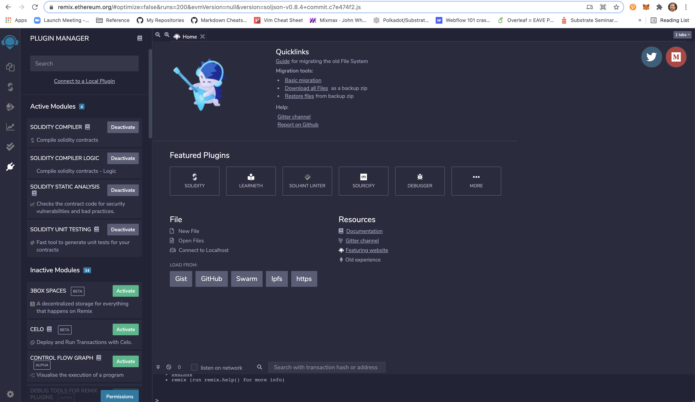

### Importing the contract

We are going to use Preset [`ERC721PresetMinterPauserAutoId` ](https://docs.openzeppelin.com/contracts/3.x/api/presets#ERC721PresetMinterPauserAutoId)which is an ERC721 that is preset so it can be minted, paused and burned.

We need to import `ERC721PresetMinterPauserAutoId` into Remix.

In the File Explorer press the  :heavy_plus_sign: to _Create New File_\
Call the new file _OpenZeppelinPresetContracts.sol_

In the new file add the import statement for `ERC721PresetMinterPauserAutoId` below.

We specify a minimum version of the Solidity compiler to use and import `ERC721PresetMinterPauserAutoId` from GitHub.

Note: When importing via GitHub, you should specify the release tag, otherwise you will get the latest code in the master branch. For OpenZeppelin Contracts you should only use code published in an official release. We will import OpenZeppelin Contracts `v3.4.0`. (for further instructions on how imports work in remix see [Importing from GitHub 35](https://remix-ide.readthedocs.io/en/latest/import.html#importing-from-github) in the Remix documentation).

```
// SPDX-License-Identifier: MIT
pragma solidity ^0.8.4;

import "https://github.com/OpenZeppelin/openzeppelin-contracts/blob/v3.4.0/contracts/presets/ERC721PresetMinterPauserAutoId.sol"
```

Note when importing the contract it automatically inserts the contracts under dependencies.

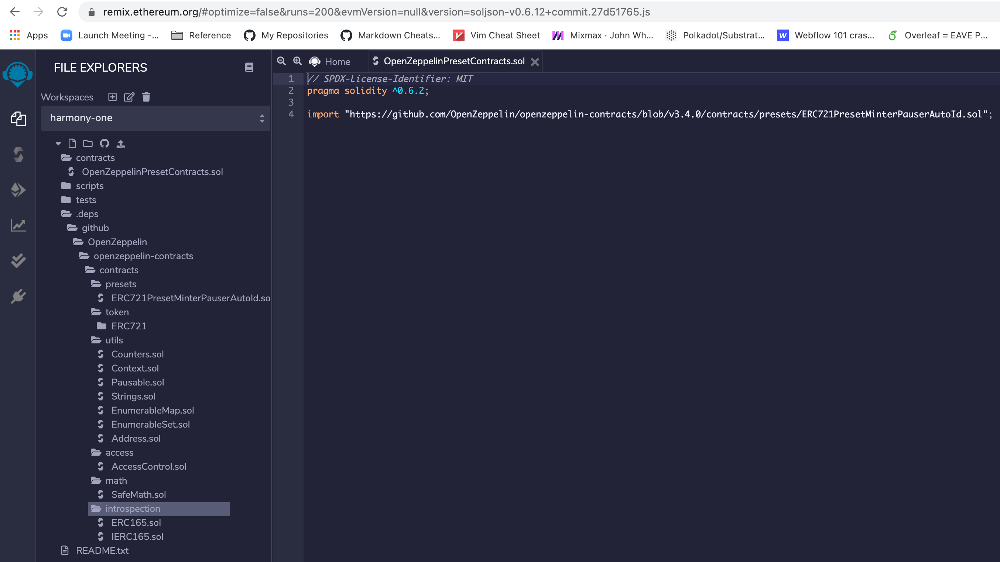

### Compile the contract

Select the _Solidity Compiler_ plugin on the left hand side of the screen.\
Press the Compile button to compile the contract.

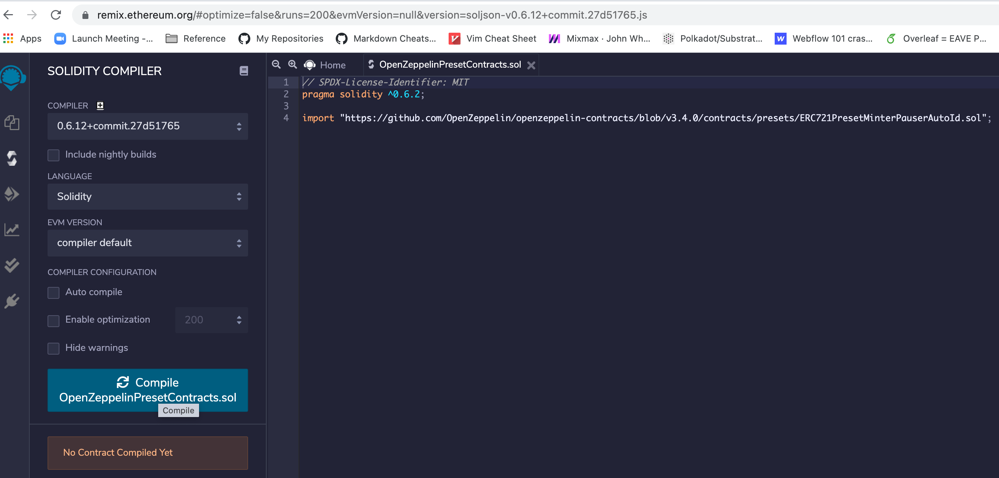

\
The contract and the contracts it inherits from will be loaded into Remix.\
The contract will then be compiled.

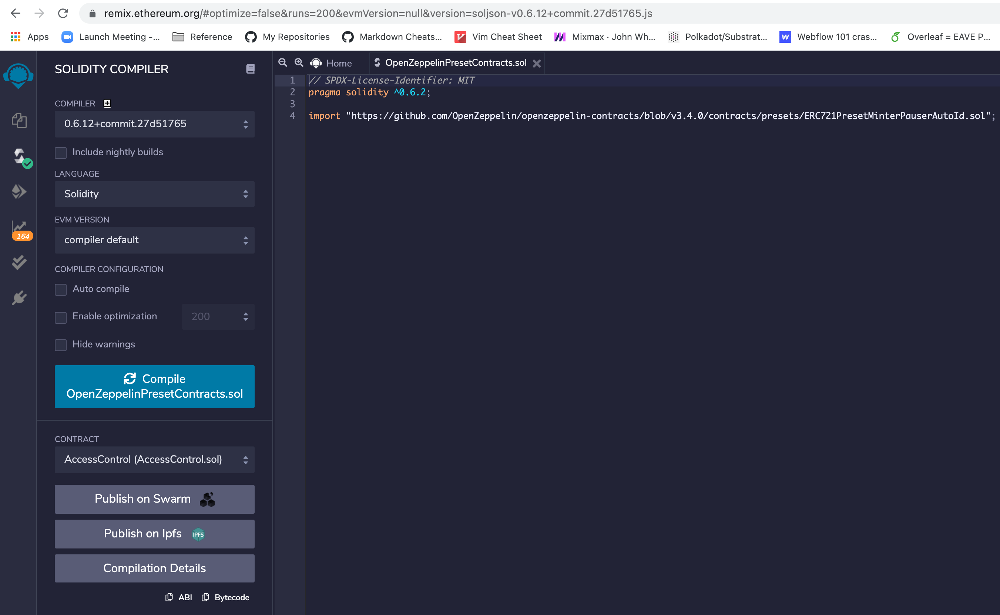

### Deploy the contract Locally

We can deploy our new token to a development blockchain. Providing a name, a symbol and a base URI as parameters to the constructor to create a new `ERC721PresetMinterPauserAutoId`.

Select the _Deploy & Run Transactions_ plugin on the left hand side of the screen.\
Environment should default to `JavaScript VM (Berlin) ` `or JavasScript VM (London)`our development blockchain.\
Change the gas limit to `5000000`\
Change the Contract to `ERC721PresetMinterPauserAutoId`

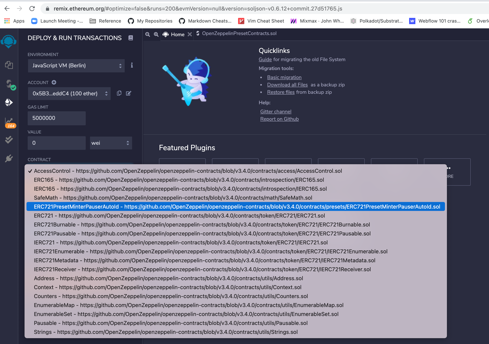

\
Specify the name, symbol and base URI to use for our new token. by selecting the drop down next to the deploy button. I am using “My NFT” and “NFT” and "[https://gateway.pinata.cloud/ipfs/QmTmHW5NDh5wUTstTLcPRkKgGU75tvapMhHtPxjcRtMkLN](https://gateway.pinata.cloud/ipfs/QmTmHW5NDh5wUTstTLcPRkKgGU75tvapMhHtPxjcRtMkLN)"

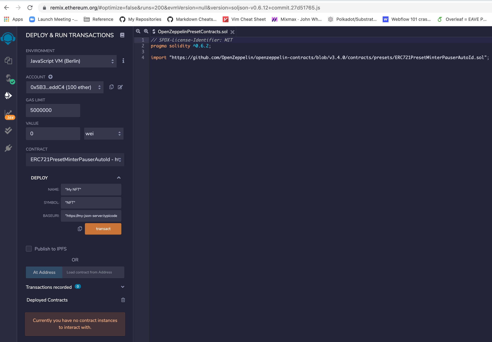

\
Press Deploy.

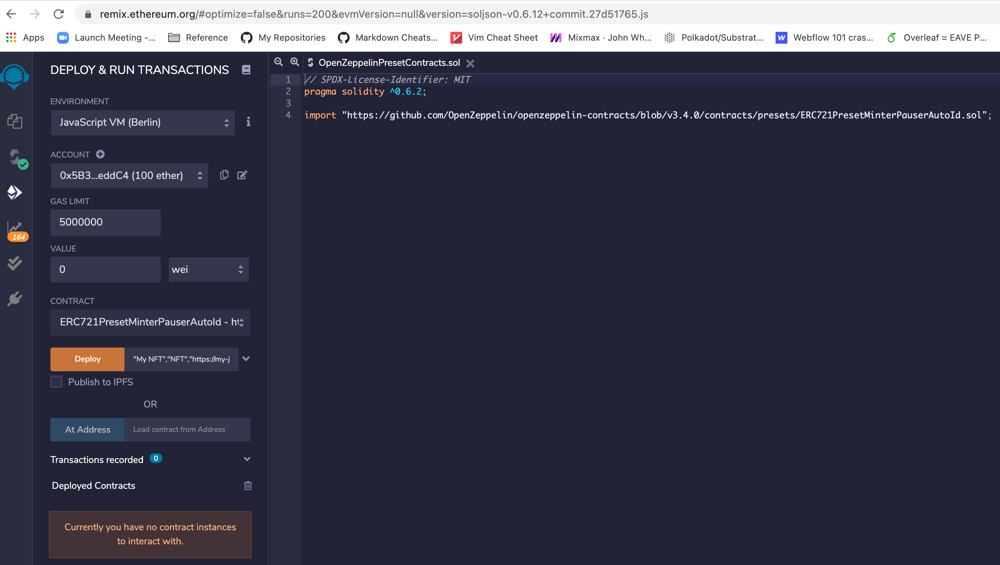

Remix will deploy our token . You can see the deployed contract under the _Deployed contracts_ section. By pressing the drop down on the right you can see the methods which you can use to interact with the token.

### Interact with our Token

We can interact with our deployed token using Remix.\
In the _Deploy & Run Transactions_ plugin, under _Deployed Contracts_ expand our deployed token (`ERC721PRESETMINTERPAUSERAUTOID`) to show the methods we can interact with. (for help see [Deployed Contracts in Remix documentation](https://remix-ide.readthedocs.io/en/latest/udapp.html#deployed-contracts))

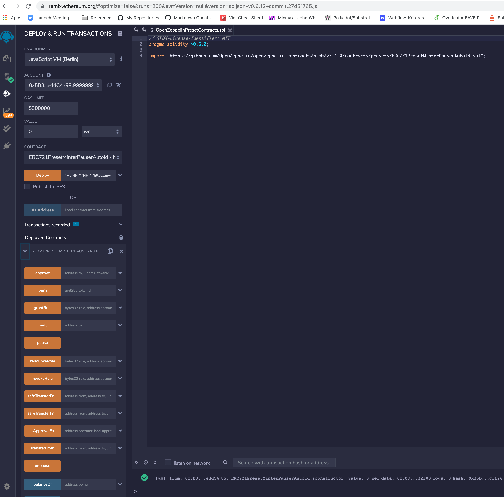

#### Token metadata

We can call the contract functions to read token metadata such as `name`, `symbol` and `baseURI`

Press the `name`, `symbol` and `baseURI` function buttons and this will call the functions in our deployed token.\
Showing values:

* `baseURI`: `0: string: https://my-json-server.typicode.com/abcoathup/samplenft/tokens/`
* `name`: `0: string: My Token`
* `symbol`: `0: string: My NFT`

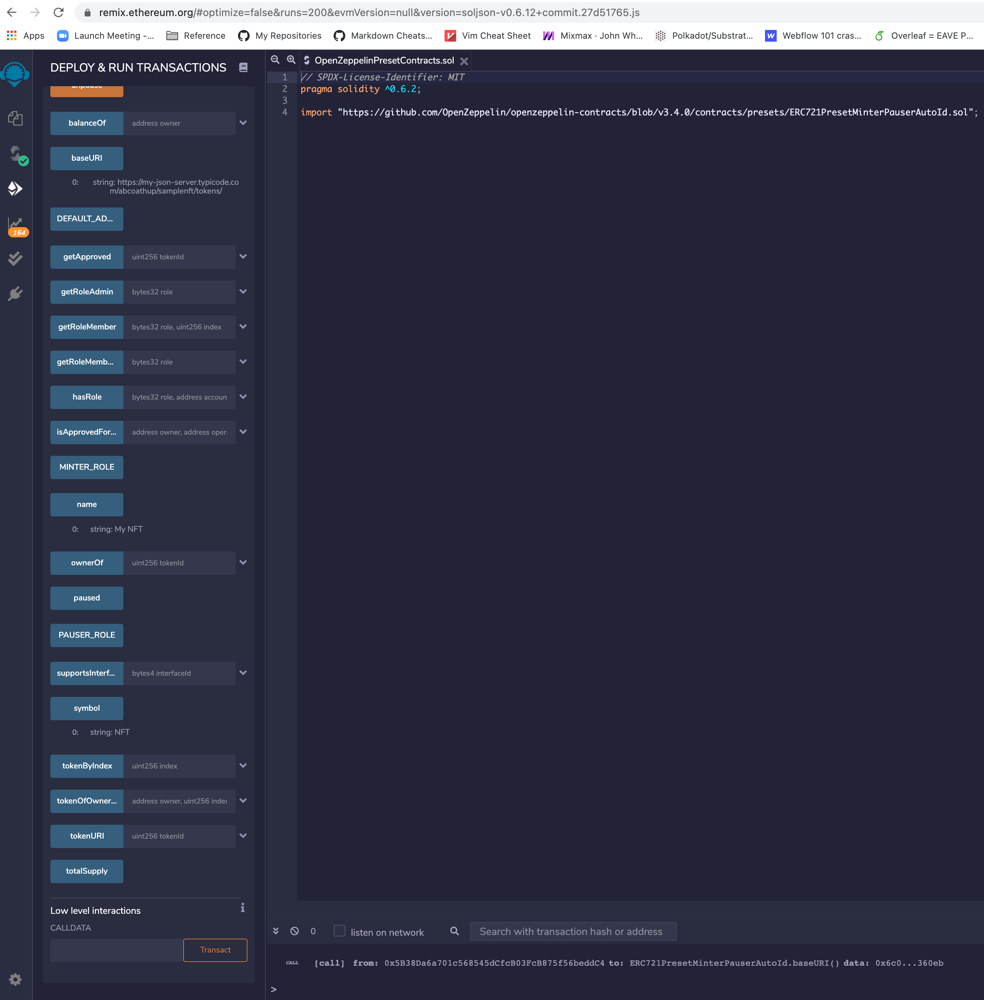


#### Mint

We can send a transaction to mint tokens to a given account, from an account with the minter role.\
In our case we are minting from the account which deployed the token, which is given the minter role.

We will mint 1 NFT with token ID 0 to our account:\
`0x5B38Da6a701c568545dCfcB03FcB875f56beddC4`

We can set the parameters as follows\
`"0x5B38Da6a701c568545dCfcB03FcB875f56beddC4"`


Press `mint`\
The transaction will be shown in the console

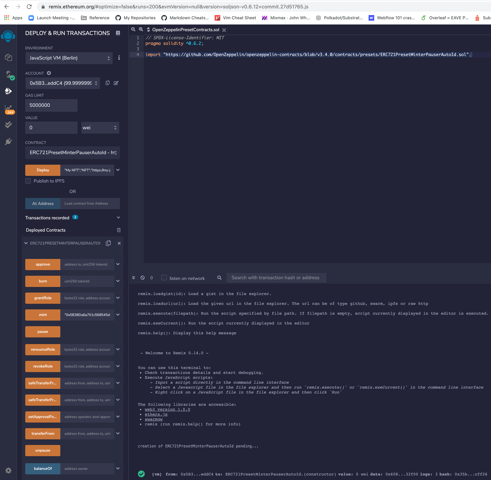

We can check the owner of the token and the token URI for the metadata\
Showing values:

* `ownerOf`: `0: address: 0x5B38Da6a701c568545dCfcB03FcB875f56beddC4`
* `tokenURI`: `0: string: https://my-json-server.typicode.com/abcoathup/samplenft/tokens/0`

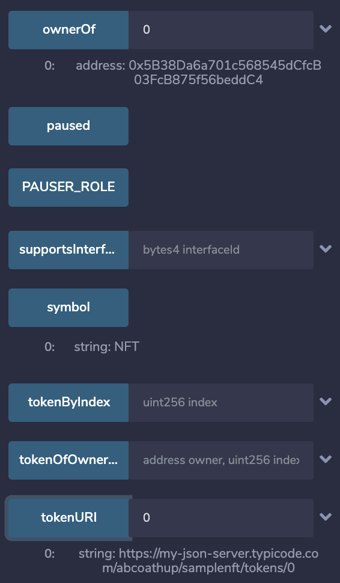

### Deploy to a Harmony testnet

#### Setup and fund your Harmony Metamask Wallet

In order to deploy to Harmony Testnet you will need to setup Metamask and get some one tokens from the faucet. 


Harmony Metamask configuration instructions are [here](https://docs.harmony.one/home/network/wallets/browser-extensions-wallets/metamask-wallet).

Harmony Faucet Information is [here](https://docs.harmony.one/home/developers/network-and-faucets).


After successful setup and funding your Metamask should look like this

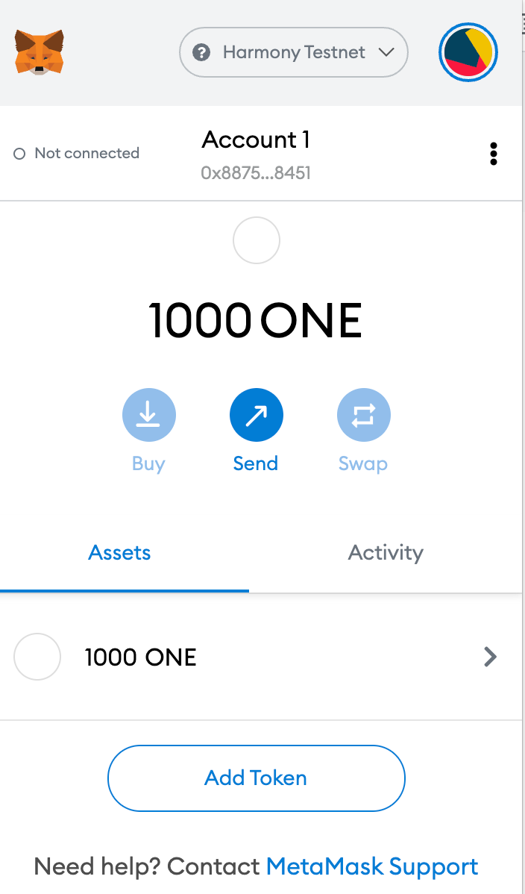

#### Deploy to Harmony Testnet

Set the network in MetaMask to Harmony Testnet.\
Change the environment in Deploy and Run Transactions to `Injected Web3` so that Remix uses web3 from MetaMask

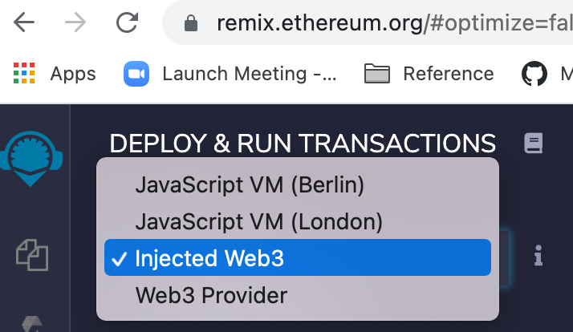

Check the gas limit is set to `5000000`\
Check the Contract is set to `ERC721PresetMinterPauserAutoId`\
Specify the name, symbol and base URI to use for our new token. I am using “My NFT” and “NFT” and “[https://gateway.pinata.cloud/ipfs/QmVkDbc6NPni1uzQq3gsiocUc3YGZjF7QGcM37hMcBqNmv](https://gateway.pinata.cloud/ipfs/QmVkDbc6NPni1uzQq3gsiocUc3YGZjF7QGcM37hMcBqNmv)"

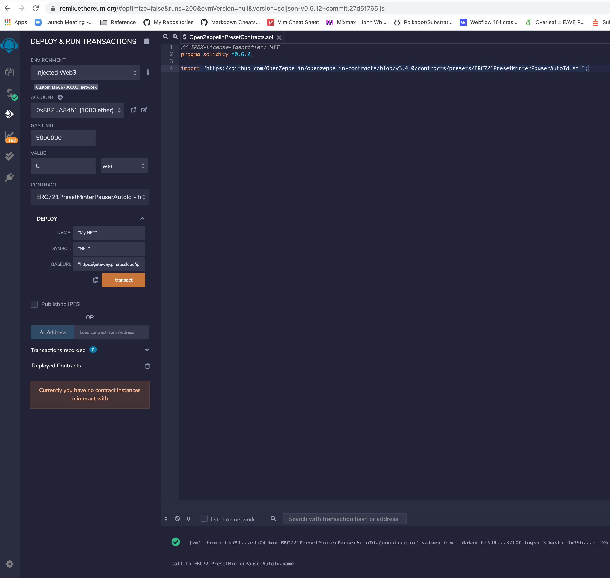

\
Press Deploy.\
Confirm the transaction in MetaMask\
The console will show `creation of ERC721PresetMinterPauserAutoId pending...` and then shortly after the contract will be deployed.

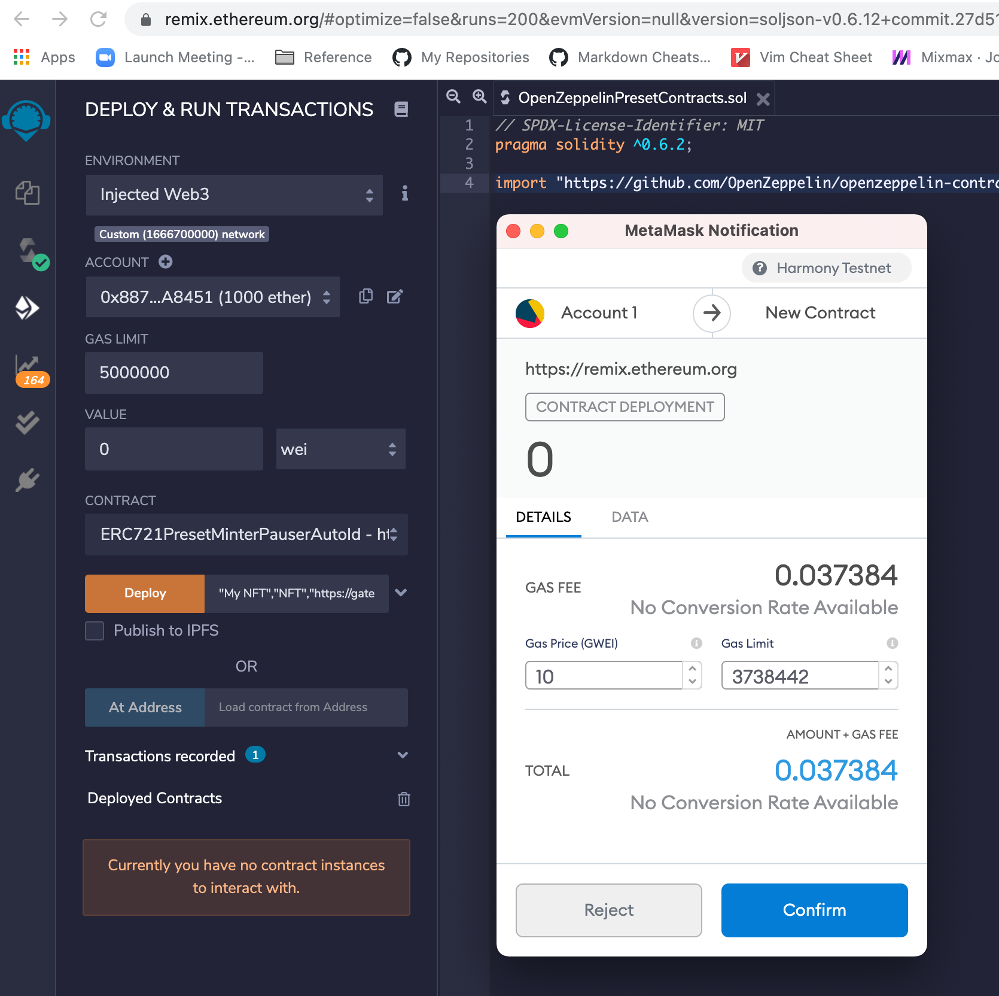

You will be able to see the contract deployed in metamask and the harmony explorer, for example [here](https://explorer.pops.one/tx/0xf4eaf7221f613b3d7d776713f8b33e5cbce80a74d5d3e7f0e6f4b91fd0b855b5) is the contract I deployed.


#### Mint

We can send a transaction to mint tokens to a given account, from an account with the minter role.

In our case we are minting from the account which deployed the token, which is given the minter role.

We will mint 1 NFT with token ID 0. Specify the address that you want to be the token holder (`0x8875fc2A47E35ACD1784bB5f58f563dFE86A8451` is one of my test accounts)

Press mint with the recipient address\
Confirm the transaction in MetaMask

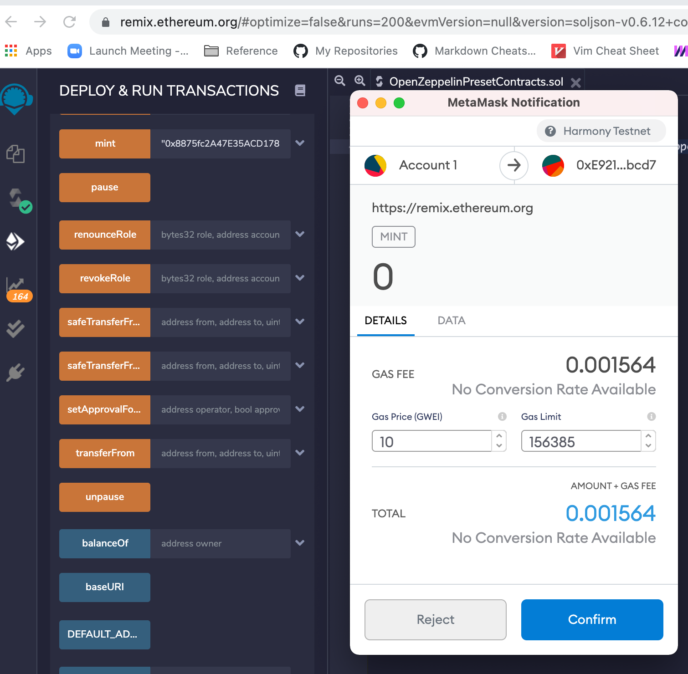

\
The console will show `transact to ERC721PresetMinterPauserAutoId.mint pending ...` and then shortly afterwards the NFT will be minted

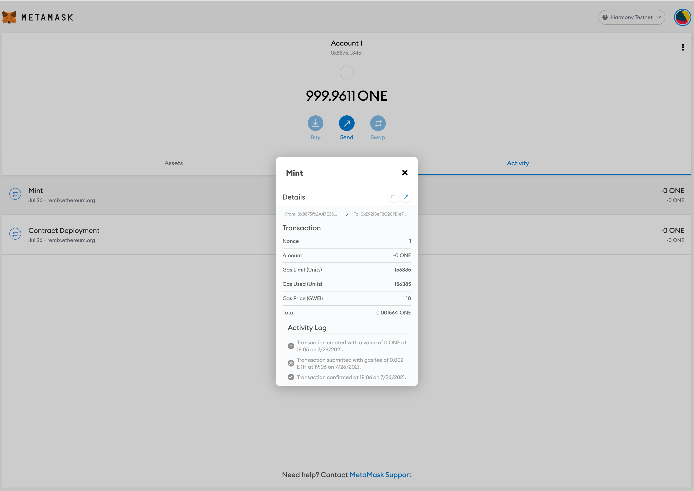

### Viewing the NFT Token in Metamask

By using the explorer and looking at your transaction history for your metamask account you can find the address of the NFT contract deployed. Our account is [here](https://explorer.pops.one/address/0x8875fc2a47e35acd1784bb5f58f563dfe86a8451) and our NFT contract is [here](https://explorer.pops.one/address/0xe9218ef3c209e1e7db8bef2e33f822006b44bcd7).

You can then add that token address to metamask, 

Our NFT contract address is `0xe9218ef3c209e1e7db8bef2e33f822006b44bcd7` 

We add the NFT Token Contract

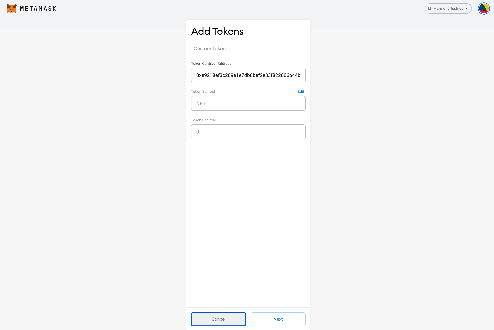

and after adding it to metamask we see


### Next steps

* Create your artwork and metadata.
* Host your images and metadata in a location that will last the life of the token.
* Define what rights your token holders have.
* [Prepare for mainnet 76](https://docs.openzeppelin.com/learn/preparing-for-mainnet).
