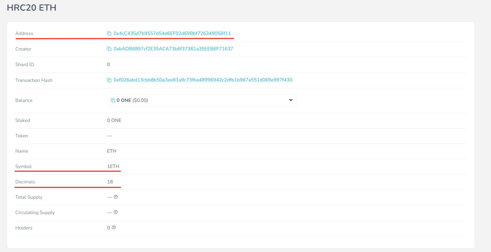
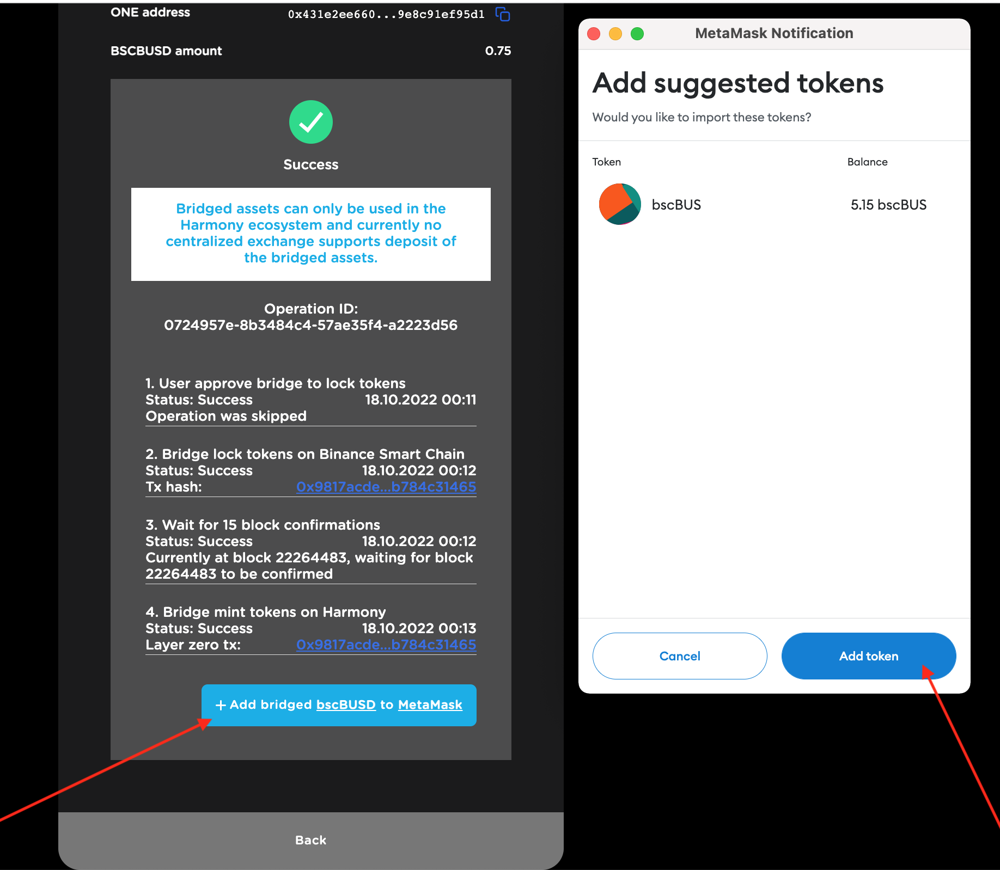

# How to find a bridged token address

You can find your token from your final step transaction if it’s correctly displayed (sometimes there are delays in data representation).There is a token symbol near the amount in “Tokens transferred”/ ”Token transfers” section that leads to the token page.

You can also look for the token in a token list on your wallet address page in the target chain explorer (it also can take some time for a token to appear).

Click on the token symbol, and you’ll see all necessary token information.

Don’t forget, that address should be in **ETH style** (starting **0x**...). For Harmony Explorer, there is a switcher in the top right corner.

If you can’t find your token there, please use [this page](bridged-tokens.md) to find a token address you should have after the bridge.

After you find your token, add it to your wallet as shown <a href="https://docs.harmony.one/home/general/wallets/browser-extensions-wallets/metamask-wallet/adding-custom-harmony-tokens" target="_blank" rel="noreferrer">
here.
</a>
You can avoid this process if you use Add token to Metamask button on the bottom your bridge operation page after operation is completed:

Check that you add token to a receiver wallet of your operation and the wallet is connected to the correct network.
