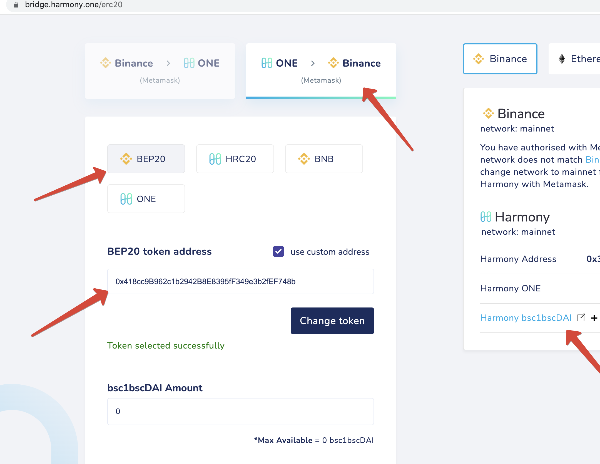
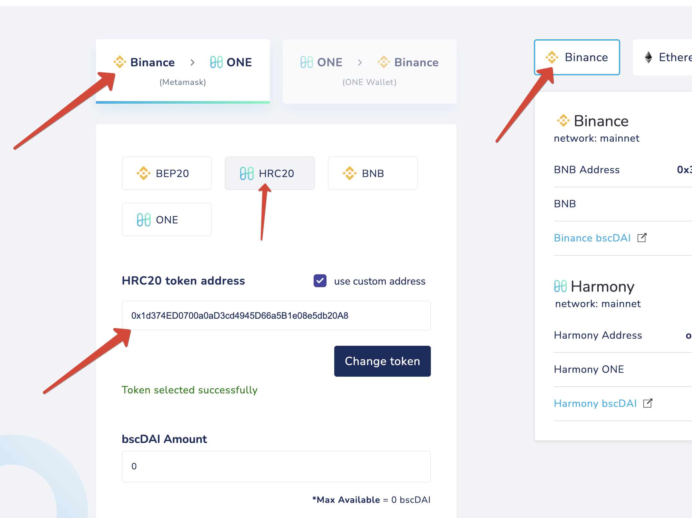
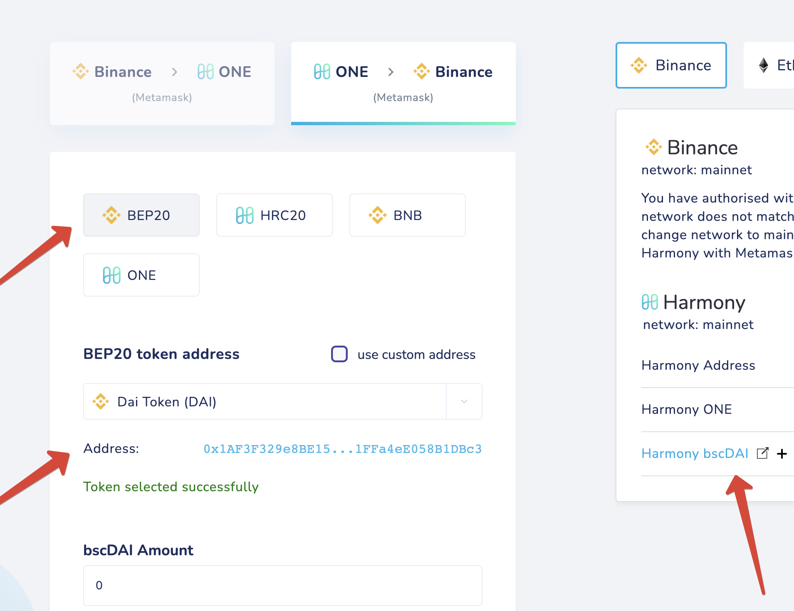

# bsc1bscDAI

Steps to unwrap: 

**bsc1bscDAI → 1bscDAI → bscDAI → DAI**

**bsc1bscDAI → 1bscDAI** 

1)  First, you need to bridge your bsc1bscDAI from Harmony to Binance. 

Operation details:

from Harmony ****to ****Binance

type: **BEP20**

custom token: **0x418cc9B962c1b2942B8E8395fF349e3b2fEF748b**

**1bscDAI → bscDAI**

2) As a result, you will get **1bscDAI**. 

Please bridge your 1bscDAI from Binance to Harmony. 
Settings: **HRC20,** custom token: **0x1d374ED0700a0aD3cd4945D66a5B1e08e5db20A8**

Now you should have **bscDAI** in your wallet. 

**bscDAI → DAI**

You can swap your bscDAI tokens or send them back to BSC and get DAI.

If you want to swap your tokens, you can use [https://viperswap.one/#/swap](https://viperswap.one/#/swap) or ask about available DEX in the Harmony community groups.

If you want to bridge your tokens back, you need to do the following operation:
from ****Harmony to **Binance**
type: **BEP20**
Choose **DAI Token (DAI)** from the list (the address is **0x1AF3F329e8BE154074D8769D1FFa4eE058B1DBc3**)

