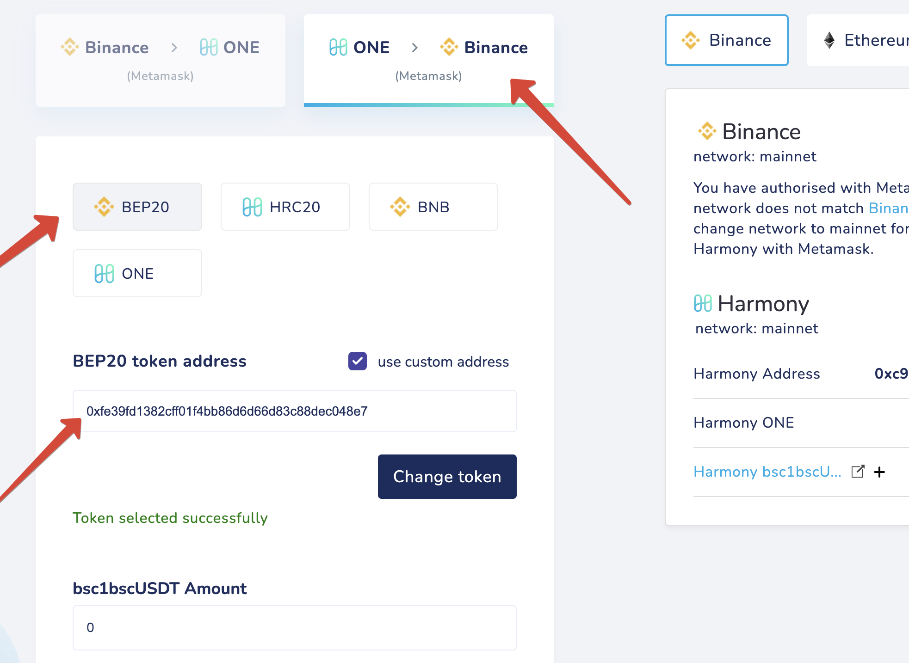
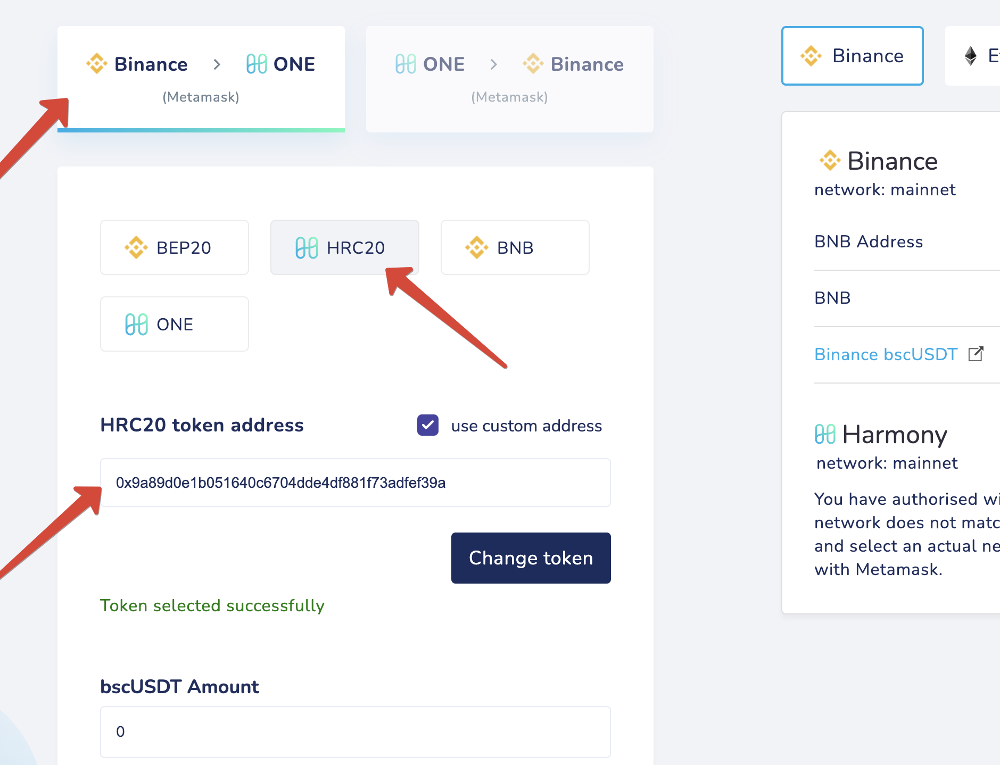
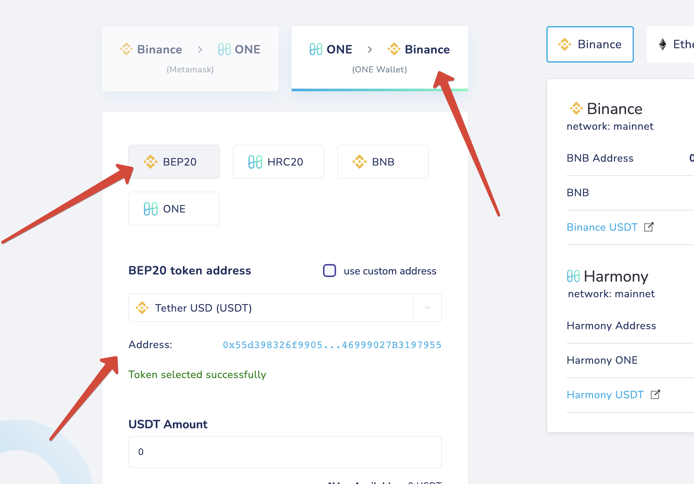

# bsc1bscUSDT

Steps to unwrap: 

**bsc1bscUSDT → 1bscUSDT → bscUSDT → USDT**

**bsc1bscUSDT → 1bscUSDT** 

Bridge your bsc1bscUSDT from Harmony to **Binance**

Settings: **BEP20**, custom token address: **0xfe39fd1382cff01f4bb86d6d66d83c88dec048e7**

**1bscUSDT → bscUSDT**

Bridge 1bscUSDT token from **Binance** **to** **Harmony**

Settings: **HRC20**, custom token address: **0x9a89d0e1b051640c6704dde4df881f73adfef39a**

Now you have **bscUSDT** tokens which you can swap or bridge. 

If you want to swap your tokens, you can use [https://viperswap.one/#/swap](https://viperswap.one/#/swap) or ask about available DEX in the Harmony community groups.

For bridging them from Harmony **to Binance**, use the following settings:
**BEP20**, choose **Tether USD (USDT)** from the list. 
Token address: **0x55d398326f99059fF775485246999027B3197955**

