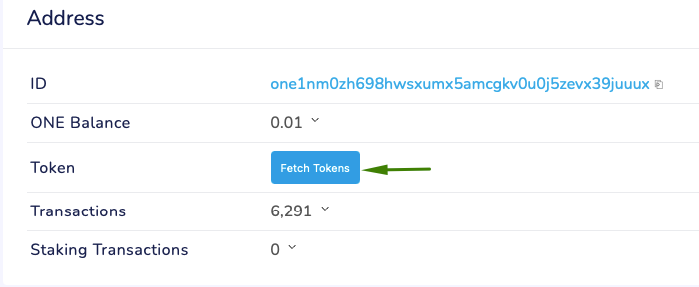
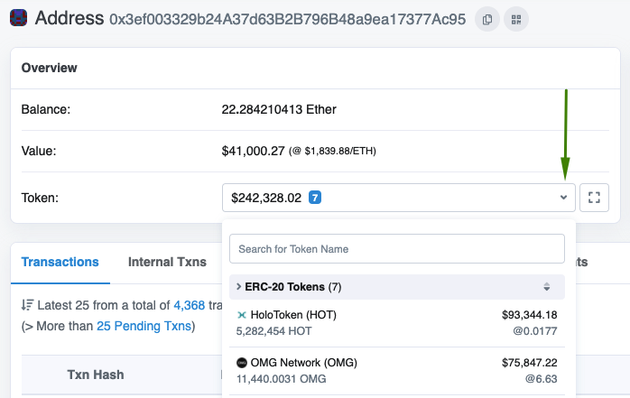
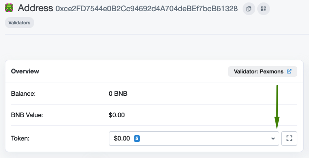

# Bridge FAQ's

After the launch of bridges with[ Ethereum](bridging-eth-one.md) and [Binance Smart Chain](bridging-bsc-one.md) (BSC) and multiple DEXes on Harmony, we have been getting a lot of questions and feedback about how to navigate around this multi-chain world.

We will try and answer a few common ones below:

## **1. What should I use the bridge for? How can I see the new assets bridged on Harmony**

The Bridge is used to migrate assets from one chain to another. If you have assets on Ethereum or Binance Smart Chain, you can use the bridge to move the same asset to Harmony blockchain. To read about how the bridge actually works, [read here](https://harmony.one/horizon).

## 2. Can I send bridged tokens from Harmony blockchain to other blockchains or exchanges?

No, do **NOT** send bridged tokens directly to other blockchains or exchanges. This will not work and might result in permanent loss of your tokens. Bridged tokens can only be used on Harmony network. The only way to send them out is by bridging them back.

## 3. What if I can't find the token I want to bridge in the drop down menu of the bridge?

Most tokens can be found using the drop down menu on the bridge. If you cannot find the token you are looking for you can add it manually by clicking on “**use custom address**”, inpputing the contract address you want to interact with and then clicking on “**Select token**”. If an asset has been bridged at least once, you will easily find it [here](https://bridge.harmony.one/tokens).

## 4. How can I verify on block explorer whether I received the bridged tokens or not?

### Harmony

On Harmony blockchain you can use the [Harmony Block Explorer](https://explorer.harmony.one) to Fetch Tokens. \
Example:[ https://explorer.harmony.one/#/address/one1nm0zh698hwsxumx5amcgkv0u0j5zevx39juuux](https://explorer.harmony.one/#/address/one1nm0zh698hwsxumx5amcgkv0u0j5zevx39juuux)

### Ethereum

On Ethereum blockchain you can use the [Etherscan Block Explorer](https://etherscan.io).\
Example: [https://etherscan.io/address/0x3ef003329b24a37d63b2b796b48a9ea17377ac95](https://etherscan.io/address/0x3ef003329b24a37d63b2b796b48a9ea17377ac95)

### Binance Smart Chain (BSC)

On Binance Smart Chain you can use [Binance Smart Chain Explorer](https://bscscan.com).\
Example: [https://bscscan.com/address/0xce2fd7544e0b2cc94692d4a704debef7bcb61328](https://bscscan.com/address/0xce2fd7544e0b2cc94692d4a704debef7bcb61328)

## 5. What is the difference between BUSD and bscBUSD on Harmony?

On Harmony, BUSD represents the token bridged from Ethereum blockchain, while bscBUSD represents the token bridged from Binance Smart Chain (BSC).

## 6. Which coins do I need to have to pay the transaction fees on the bridge?

It depends on which blockchain you want transfer assets from. If it is from Harmony blockchain, you need ONE tokens, if it is from Ethereum you need ETH tokens, from Binance Smart Chain (BSC) BNB tokens and so on.
