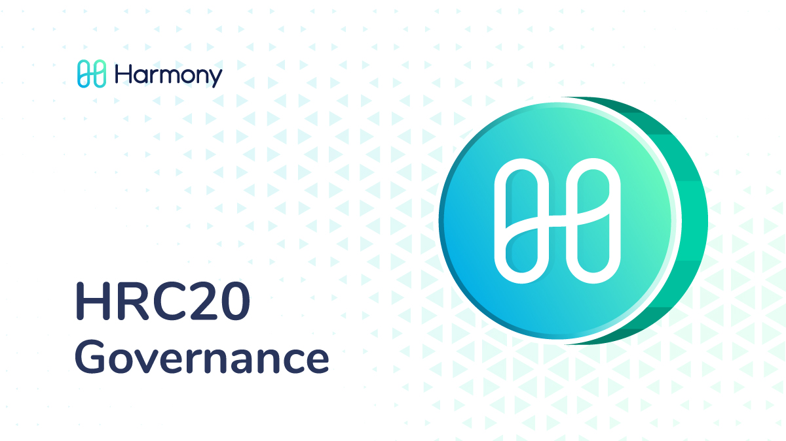
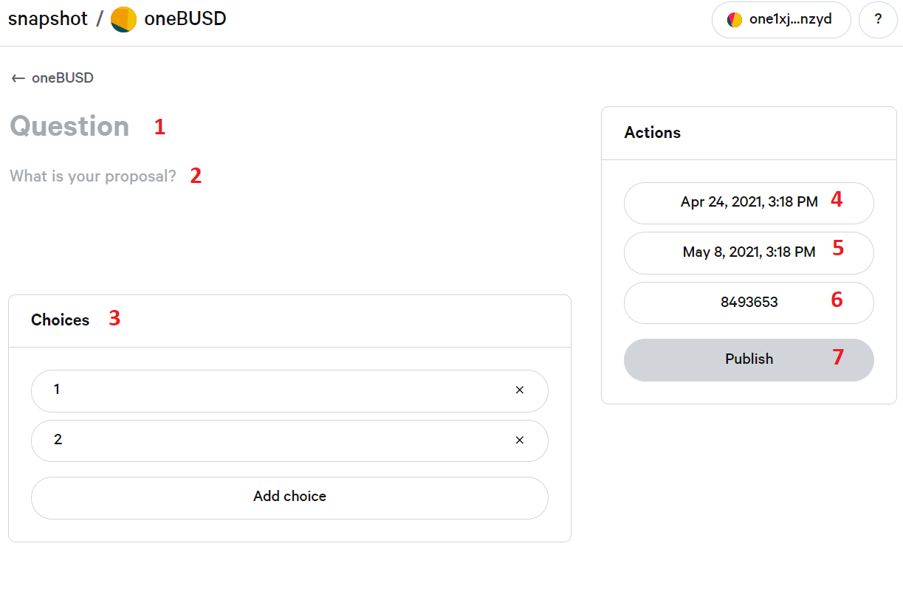
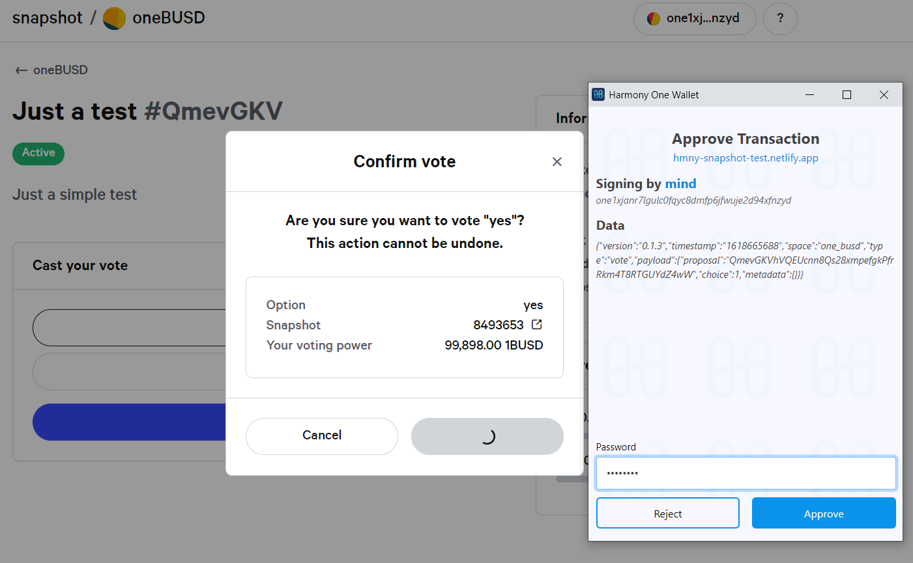

# HRC-20 Governance

## What is an HRC-20?

HRC-20 are fungible tokens minted on the Harmony network, much like ERC-20 tokens are on Ethereum. Functionality wise, the HRC-20 is similar to ERC-20 tokens like USDC, UNI, SUSHI, etc., except that it is issued and used on the Harmony network, instead of on the Ethereum network. This is most useful for any applications that need their own token and want to build on Harmony.

## Why Governance?&#x20;

Governance is an important aspect in the blockchain world today. It represents the ability for people to vote, much like everyone votes for political parties, presidents, etc. In blockchain it is no different, except that it is decentralized and radically more fair. In Harmony, we want our communities to have their voices heard and their votes matter. The community members get to help make decisions on Harmony or protocols living on it. We want every single user to have their voice heard and help drive the projects further as a decentralized community.

## Projects: How do you apply for your own governance section?&#x20;

Project owners or users can apply for the governance section by following these steps:&#x20;

* Fork this repository [https://github.com/harmony-one/snapshot-spaces](https://github.com/harmony-one/snapshot-spaces)
* Create project name in the “spaces” directory, containing the files as in the “examples” sub-folder
* Create any changes to the voting mechanism, such as including the staked or LP-ed tokens by modifying the snapshot.js library which is managed by snapshot-lab. You can submit a PR in this repo: [https://github.com/snapshot-labs/snapshot.js](https://github.com/snapshot-labs/snapshot.js)
* Submit a whitelist of addresses that are allowed to create proposals (optional) Submit a PR to the original repository; add reviewers

## Users: How does it work?&#x20;

The governance app is available at [https://governance.harmony.one](https://governance.harmony.one). To interact with it, you need to connect your [One Wallet](../wallets/browser-extensions-wallets/one-wallet.md) or [Metamask](../wallets/browser-extensions-wallets/metamask-wallet/), the same as using Metamask on Ethereum.

Any HRC-20 token holder can create or vote on proposals within their own project, unless specified differently by the project creators. For example, Mochi (hMochi) owners can create and vote on Mochiswap projects. When voting, by default, only the tokens you hold in the wallet will contribute to your voting power, unless specified differently by the project.

Rules and guidelines: Anyone can create a proposal that hold the correlated HRC-20 token, unless specified differently by the project The voting proposal on forum should include details on what percentage of total tokens held is needed for the vote to pass and have the project name in bracket before the name, for example: \[Mochiswap] Change of farming rewards The voting app takes a snapshot of the balances at the block in which it was created, so your voting power is therefore locked in to whatever amount of tokens you held at that point All votes are final, once you approve your vote, you cannot undo or change it

## Creating a Proposal&#x20;

To create a proposal navigate to the [governance app](https://governance.harmony.one), connect your [One Wallet ](../wallets/browser-extensions-wallets/one-wallet.md)or [MetaMask](../wallets/browser-extensions-wallets/metamask-wallet/), then click on New proposal on the top right corner. You can now start writing a new proposal:

1 - The title of the proposal.\
2 - The body of the proposal; e.g. what you want people to vote on and any explanation, facts, examples, etc. The proposal should include the following key sections:

* Summary: one short paragraph to describe the proposal
* Background: background information on the proposal
* Link: link to the detailed proposal and discussion in the forum
* Motivation: why this proposal is needed and important
* Specification: specific action or changes proposed in the proposal
* Vote: specify voting options and what each one means if voted for

3 - Voting choices; you add choices for voting, minimum is 2, but you can always add more choices with the Add choice button below.\
4 - Select the date and time at which the proposal will be open for voting.\
5 - Select date and time at which the proposal will close for voting.\
6 - The block number in which the proposal was submitted.\
7 - Publish once done with all previous steps and confirm with a signed message from your validator address via One Wallet.

## Voting on a Proposal

To vote for a proposal, simply navigate to the Active tab and click on a proposal you want to vote on. Read what the proposal is about, select your choice and confirm with a signed message from your wallet:

