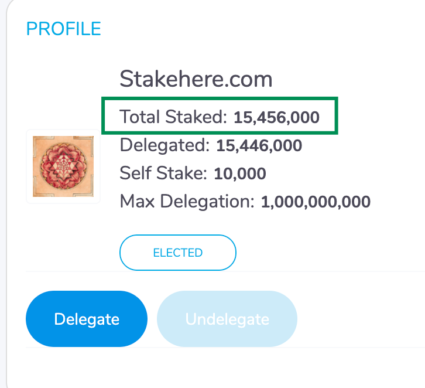

# Why am i not Elected?

## How is the committee chosen?

Harmony operates with Effective Proof of Stake (EPoS) to keep the network security from collecting in the hands of a few validators. You can find our full Medium article on EPoS [here](https://harmony.one/epos)!

TL;DR Validators are elected based on their **effective** stake, instead of their absolute stake. The effective stake is calculated based on the median stake in the network. The top 900 BLS keys with the highest effective stake will be elected for the epoch.

## 1. Verify Bidding

### 1.1 Check the network median stake



```bash
./hmy --node="https://api.s0.t.hmny.io" blockchain median-stake | grep median
```



```bash
./hmy --node="https://api.s0.b.hmny.io" blockchain median-stake | grep median
```




The value returned by the CLI is in Atto, which is equivalent to Gwei in Ethereum.


### 1.2 Verify the amount delegated to the Validator

Visit [https://staking.harmony.one/validators/](https://staking.harmony.one/validators/)\<youroneaccount>

Example : [https://staking.harmony.one/validators/one1u6c4wer2dkm767hmjeehnwu6tqqur62gx9vqsd](https://staking.harmony.one/validators/one1u6c4wer2dkm767hmjeehnwu6tqqur62gx9vqsd)



Your `Total Staked` divided by the number of BLS keys you set on your validator will give you the effective bidding stake. This effective bidding stake will be used to bid in the 900 slots available each epoch. Bidding above the median stake is the safest way to get your keys elected each epoch. Bidding below the median stake is riskier, as you may be kicked out of the committee for 1 epoch in case you outbid. For more information on the bidding process check [here](../definitions/slots-bidding-and-election.md).


We recommend that you start bidding above or around the median stake, so you are likely to always stay elected each epoch.


## **2. Verify if the** Validator is Active

Run the command below:



```bash
./hmy --node="https://api.s0.t.hmny.io" blockchain validator information  one1u6c4wer2dkm767hmjeehnwu6tqqur62gx9vqsd | grep epos-status
```



```bash
./hmy --node="https://api.s0.b.hmny.io" blockchain validator information  one1u6c4wer2dkm767hmjeehnwu6tqqur62gx9vqsd | grep epos-status
```



Output:

```bash
"epos-status": "currently elected",
```

If **not eligible**, activate it for the next epoch election:



```bash
./hmy --node="https://api.s0.t.hmny.io" staking edit-validator --validator-addr one1u6c4wer2dkm767hmjeehnwu6tqqur62gx9vqsd --active true --passphrase
```



```bash
./hmy --node="https://api.s0.b.hmny.io" staking edit-validator --validator-addr one1u6c4wer2dkm767hmjeehnwu6tqqur62gx9vqsd --active true --passphrase
```



## **3. Verify Signing Rate**

Run the command below:



```bash
./hmy --node="https://api.s0.t.hmny.io" blockchain validator information one1u6c4wer2dkm767hmjeehnwu6tqqur62gx9vqsd
```



```bash
./hmy --node="https://api.s0.b.hmny.io" blockchain validator information one1u6c4wer2dkm767hmjeehnwu6tqqur62gx9vqsd
```



Output:

```bash
    "current-epoch-performance": {
      "current-epoch-signing-percent": {
        "current-epoch-signed": 50,
        "current-epoch-signing-percentage": "0.500000000000000000",
        "current-epoch-to-sign": 100,
        "num-beacon-blocks-until-next-epoch": 28
      }
    },
```

For your validator to stay elected, you wanna make sure the `current-epoch-signing-percentage` is above 66% (0.66).

To fix the above, we have to make sure the node is working correctly and below are few pointers

## 4. Verify if Node is In Sync

Compare your node block height with the network block height.

Check your node block height:

```bash
 ./hmy blockchain latest-headers | grep number
```


If the above doesn’t work and you have an error message similar to this: _commit: v304-0e26945, error: dial tcp4 127.0.0.1:9500: connect: connection refused_\
It means the harmony node binary is not running. Please follow this documentation on [how to run the node](../node-setup/).


Check the network block height:



```bash
./hmy --node="https://api.s0.t.hmny.io" blockchain latest-headers | grep number
```



```bash
./hmy --node="https://api.s0.b.hmny.io" blockchain latest-headers | grep number
```



Make sure network height and your current height are very close or equal. Additionally if your node is validating for a


The above command is for network height on shard 0, change s0 to s1, s2, .. to match the shard you want to check.


When you are fully synced and your validator profile is satisfactory you should start having BINGOs in your validator log file at **epoch change**.

You can check BINGOs via this command:

```bash
tail -f latest/zero*.log | grep BINGO
```

And you’ll notice in your validator information that you started signing blocks.

Output:

```bash
    "current-epoch-performance": {
      "current-epoch-signing-percent": {
        "current-epoch-signed": 60,
        "current-epoch-signing-percentage": "1.000000000000000000",
        "current-epoch-to-sign": 60,
        "num-beacon-blocks-until-next-epoch": 28
      }
    },
```

**If you fail** to sign blocks, verify your machine/vps doesn't have CPU/memory/hard disk/internet issues. When you fail to sign more than 66% of the blocks in an epoch, you’ll be kicked out from the committee.
