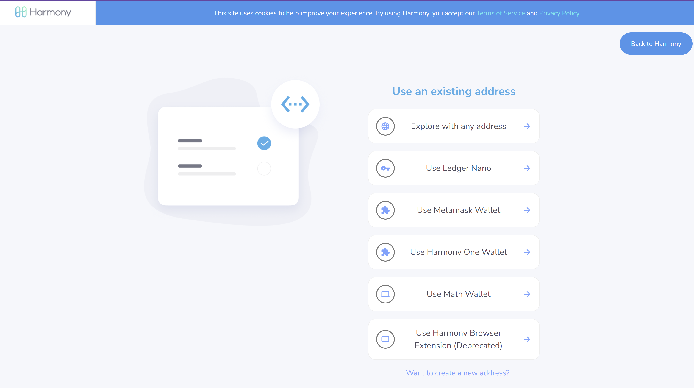

# Signing Transactions

## Download and Setup CLI Tool

Please download and set up CLI tool to use ledger for signing transactions using the instructions [here](https://app.gitbook.com/@harmony-one/s/home/wallet-guides/harmony-cli/download-setup).

## Display the Harmony ONE address for Ledger Nano S <a id="display-the-harmony-one-address-for-ledger-nano-s"></a>

As Ledger Nano S is connected to PC/Mac through USB, super user's permission is needed to open the USB. To use the Ledger Nano S hardware wallet, run harmony CLI **under sudo** and **\*\*use command** keys list --ledger\*\*

```text
$./hmy.sh keys list --ledge
```

After running the keys command with --ledger option, the following GUI will be displayed on Ledger Nano S LED screen:


There are two buttons on top of Ledger Nano, click the right one to continue \(or click the left one to cancel\). After that, the following address will be shown on Ledger Nano S LED screen:‌


As the address is longer than the LED screen, you can use the top two button to shift the address display to the left or side right side. Click both buttons to confirm the address and it should be same as displayed on PC/Mac terminal.‌

The entire process is shown in video below:



## Display token balance for Ledger Nano S <a id="display-token-balance-for-ledger-nano-s"></a>

Balance on any Harmony wallet addresses can be displayed using CLI with command **balance** using the following command line options:

```text
$./hmy.sh balance --node=[server_address] [address]
```

Here \[server\_address\] is the server address for either Mainnet or Betanet \(testnet\) and \[address\] is the Harmony wallet address.‌

**Query balance on Mainnet**

```text
$./hmy.sh balance --node="https://api.s0.t.hmny.io" [address]$./hmy.sh balance --node="https://api.s0.pga.hmny.io" [address]
```

**Query balance on  Testnet**

```text
$./hmy.sh balance --node="https://api.s0.b.hmny.io" [address]
```

**Query balance on  Devnet**

```text
$./hmy.sh balance --node="https://api.s0.pga.hmny.io" [address]
```

## Token transfer using Ledger Nano S <a id="token-transfer-using-ledger-nano-s"></a>

To send token from Ledger Nano S to another wallet account, we need Ledger Nano S hardware to sign the transaction with private key inside Ledger Nano S hardware. The CLI command **transfer --ledger** should be called with sudo permission:

```text
$ ./hmy.sh transfer --ledger --node=[server_addr] \  --chain-id=[mainnet|testnet|devnet] --from [from_addr] --to [to_addr] --amount [value] \  --from-shard [shard_id] --to-shard [shard_id]
```

\[from\_addr\] is the wallet address for Ledger Nano S. Please note that \[from\_addr\] must match with Ledger Nano S's address, otherwise the transaction will fail. \[to\_addr\] is the receiver's wallet addresses. \[value\] is the amount of ONE tokens to transfer. \[shard\_id\] is a numeric value for shard ID, the value depends on Mainnet \(0,1,2,3\) or Betanet\(testnet\) \(0,1\).

Please note that you will need to unlock Ledger Nano S, and confirm the transaction parameters on Ledger Nano S.

Click the right button to start signing the transaction


Check and confirm the transfer to address is correct


Check and confirm the amount is correct.


Check and confirm the source shard ID is correct.



Check and confirm the destination shard ID is correct.


Detailed process is shown in video below:



