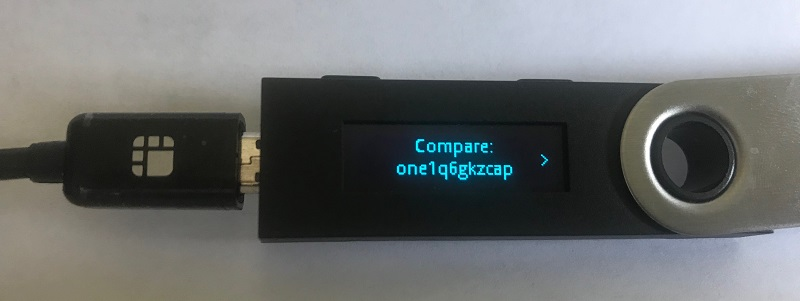
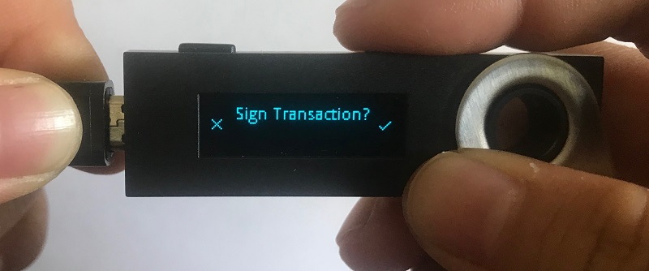
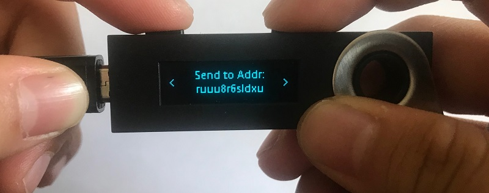

# Ledger Nano S With CLI

## Get everything together

Using Harmony hardware wallet on the Ledger Nano S requires a few things. You will need:

* Your Ledger Nano S
* The Harmony app installed on your Nano S
* The [harmony CLI app](https://docs.harmony.one/sdk-wiki/command-line-interface/using-the-harmony-cli-tool) on your computer to talk to the Nano S
* Familiarity with your computer's command-line interface \(CLI\).

## Download CLI 

_Please use the_ [_following instructions_](https://docs.harmony.one/home/wallet-guides/harmony-cli/download-setup) _to download CLI to use  Ledger Nano S ._

## Install Ledger Nano S Firmware In Debugging Mode

_This is ONLY for wallet developers / testers. Other users please download firmware through Ledger Live._

_Please use the_ [_following instructions_](https://docs.harmony.one/home/wallet-guides/ledger/install-and-setup) _to install Ledger Nano S firmware in Debugging mode._ 

## Display the Harmony ONE address for Ledger Nano S

As Ledger Nano S is connected to PC/Mac through USB, super user's permission is needed to open the USB. To use the Ledger Nano S hardware wallet, run harmony CLI **under sudo** and **use command** keys list --ledger

#### Using the Binary:

```text
$ ./hmy keys list --ledger
```

#### Using the Shell Wrapper:

```text
$ ./hmy.sh -- keys list --ledger
```

After running the keys command with --ledger option, the following GUI will be displayed on Ledger Nano S LED screen:


There are two buttons on top of Ledger Nano, click the right one to continue \(or click the left one to cancel\). After that, the following address will be shown on Ledger Nano S LED screen:‌



As the address is longer than the LED screen, you can use the top two button to shift the address display to the left or side right side. Click both buttons to confirm the address and it should be same as displayed on PC/Mac terminal.‌

The entire process is shown in video below:



## Display token balance for Ledger Nano S <a id="display-token-balance-for-ledger-nano-s"></a>

Balance on any Harmony wallet addresses can be displayed using CLI with command **balances** using the following command line options:

#### Using the binary:

```bash
$ ./hmy balances --node="<endpoint_address>" <address>
```

#### Using the Shell Wrapper:

```bash
$ ./hmy.sh -- balances --node="<endpoint_address>" <address>
```

Here &lt;endpoint\_address&gt; is the server address for either Mainnet or Testnet and &lt;address&gt; is the Harmony wallet address.‌

**Query balance on Mainnet**

```bash
$ ./hmy balances --node="https://api.s0.t.hmny.io" <address>
```

‌**Query balance on Devnet**

```bash
$ ./hmy balances --node="https://api.s0.pga.hmny.io" <address>
```

### Query balance on Testnet <a id="query-balance-on-betanet-testnet"></a>

```bash
$ ./hmy balances --node="https://api.s0.b.hmny.io" <address>
```


The actual endpoint addresses are subject to change.


## Token transfer using Ledger Nano S

To send token from Ledger Nano S to another wallet account, we need Ledger Nano S hardware to sign the transaction with private key inside Ledger Nano S hardware. The CLI command **transfer --ledger** should be called with sudo permission:

#### Using the binary:

```bash
$ ./hmy transfer --ledger --node="<endpoint_address>" \
  --chain-id={mainnet|testnet|devnet} \
  --from <from_address> --to <to_address> --amount <value> \
  --from-shard <shard_id> --to-shard <shard_id>
```

#### Using the shell:

```bash
$ ./hmy.sh -- transfer --ledger --node="<endpoint_address>" \
  --chain-id={mainnet|testnet|devnet} \
  --from <from_address> --to <to_address> --amount <value> \
  --from-shard <shard_id> --to-shard <shard_id>
```

* &lt;from\_address&gt; is the wallet address for Ledger Nano S. Please note that &lt;from\_address&gt; must match with Ledger Nano S's address, otherwise the transaction will fail.
* &lt;to\_address&gt; is the receiver's wallet addresses.
* &lt;value&gt; is the amount of ONE tokens to transfer.
* &lt;shard\_id&gt; is a numeric value for shard ID, the value depends on Mainnet \(0,1,2,3\) or Testnet\) \(0,1,2\).

Please note that you will need to unlock Ledger Nano S, and confirm the transaction parameters on Ledger Nano S.

The LED display on Nano S is shown as below :‌

Click the right button to start signing the transaction



Check and confirm the transfer to address is correct.



Check and confirm the amount is correct.


Check and confirm the source shard ID is correct.


Check and confirm the destination shard ID is correct.


Detailed process is shown in video below:

\_\_




