# Ledger Nano S With Staking Portal

## Get everything together

Using Harmony hardware wallet on the Ledger Nano S requires a few things. You will need:

* Your Ledger Nano S
* The Harmony app installed on your Nano S

## Install Ledger Nano S Firmware In Debugging Mode

_This is ONLY for wallet developers / testers. Other users please download firmware through Ledger Live._

_Please use the_ [_following instructions_](https://docs.harmony.one/home/wallet-guides/ledger/install-and-setup) _to install Ledger Nano S firmware in Debugging mode._ 

## Sign In With Ledger 

The staking website is at [https://staking.harmony.one/ledger](https://staking.harmony.one/ledger)  This site is used for staking and sending tokens.  Open the site you will see the following: 

Click the sign in button on the left side, and the signing methods will show up as below: 

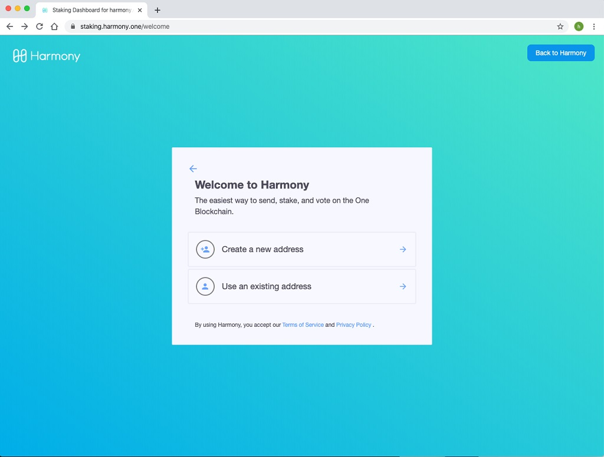

Click the "Use an existing address":

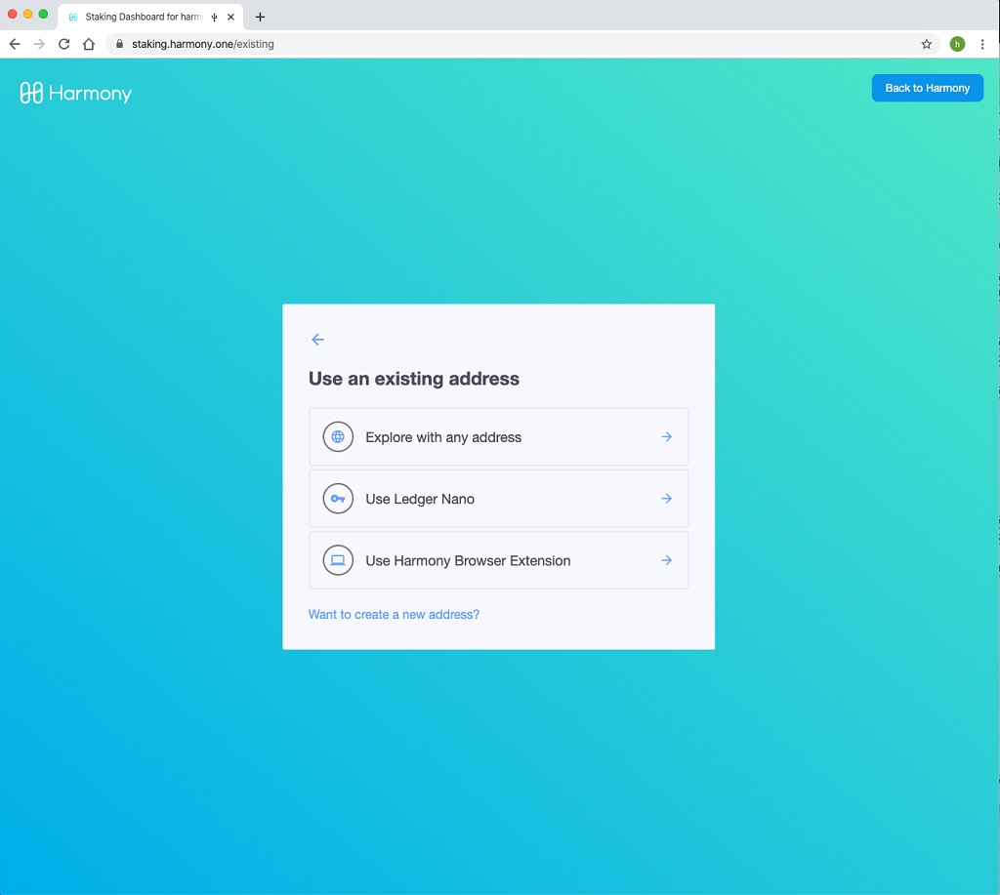

Click the "Use Ledger Nano" and it shows the following:

Click "Sign In" and check your Ledger Nano S.  It should show "Display Address" on the LED like below:

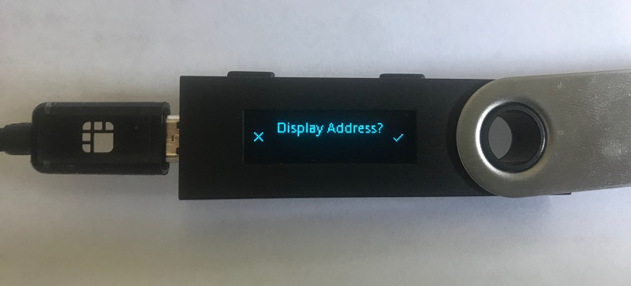

There are two buttons on top of Ledger Nano, click the right one to continue \(or click the left one to cancel\). After that, the following address will be shown on Ledger Nano S LED screen:‌

As the address is longer than the LED screen, you can use the top two button to shift the address display to the left or side right side.  After that, you should see "Wait for commands" in the LED display. 

The entire process is shown in the video below:



After that you are logged in , the computer screen should change, you will see the Harmony ONE address one the left side: under "Your Address". And it should also display the balances for the Ledger Nano S wallet using Ledger as below: 

## Sending Tokens With Ledger 

To send any token to an address, please click the send button and the send screen will display as the following:

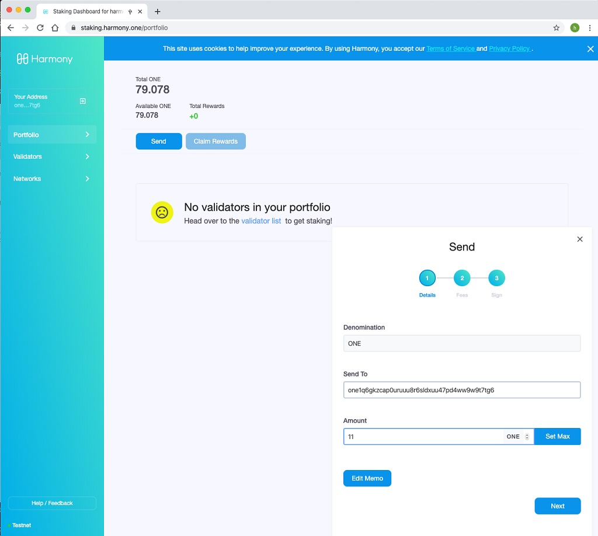

Input the amount of tokens to send and the destination address, then click the next buttons until you see the send button. Click the send button as shown below: 

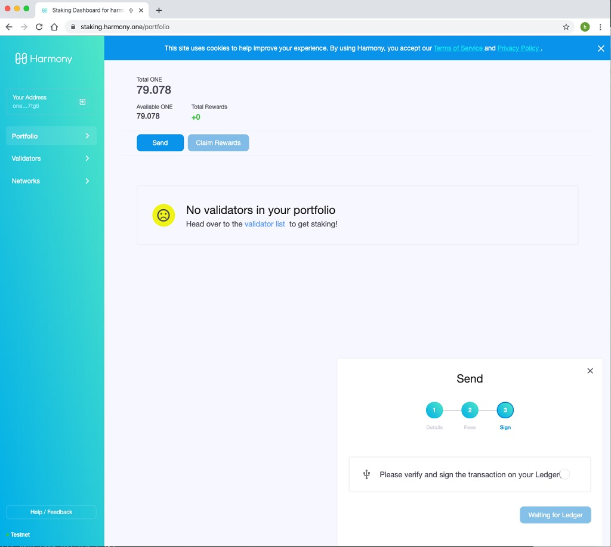

Check your ledger Nano S, the LED display on Nano S is shown as below.

Click the right button to start signing the transaction:

Check and confirm the transfer to address is correct:

Check and confirm the amount is correct:

Check and confirm the source shard ID is correct:

Check and confirm the destination shard ID is correct:

Detailed process is shown in video below:



On the computer, you will find that the transaction is sent and confirming: 

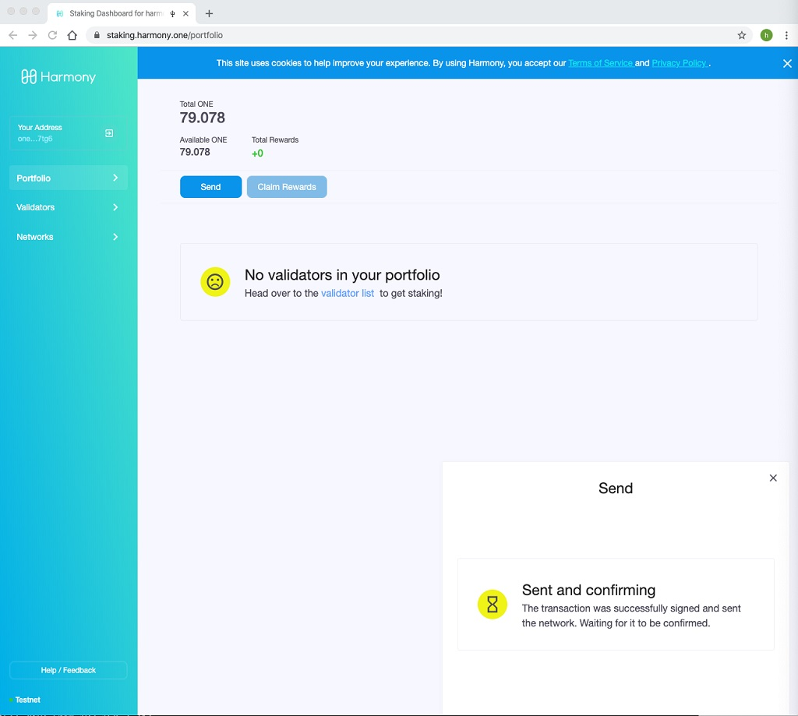

After a while, it will change to "Successful Send" 

## Sign Staking With Ledger 

Harmony app also supports signing staking transactions. To sign a staking delegation,  click the validators menu on the left side. A list of validators will be displayed as below:  

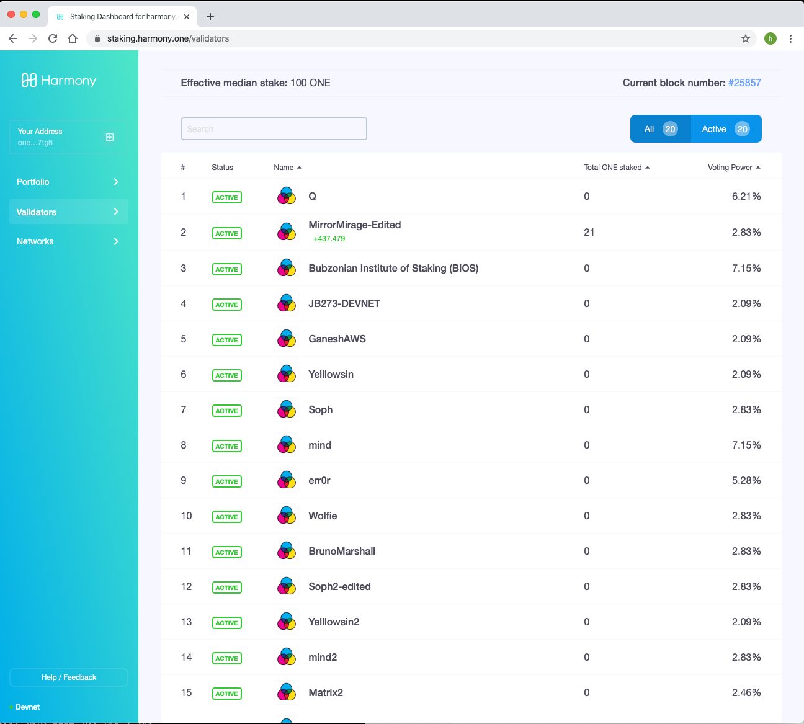

Click on any validator you want to delegate, it will show as below: 

Click the stake button to start delegation as shown below: 

Input the amount of tokens you want to delegate and keep clicking the next button until it shows "Send". Click the "Send" button and screen will display as below: 

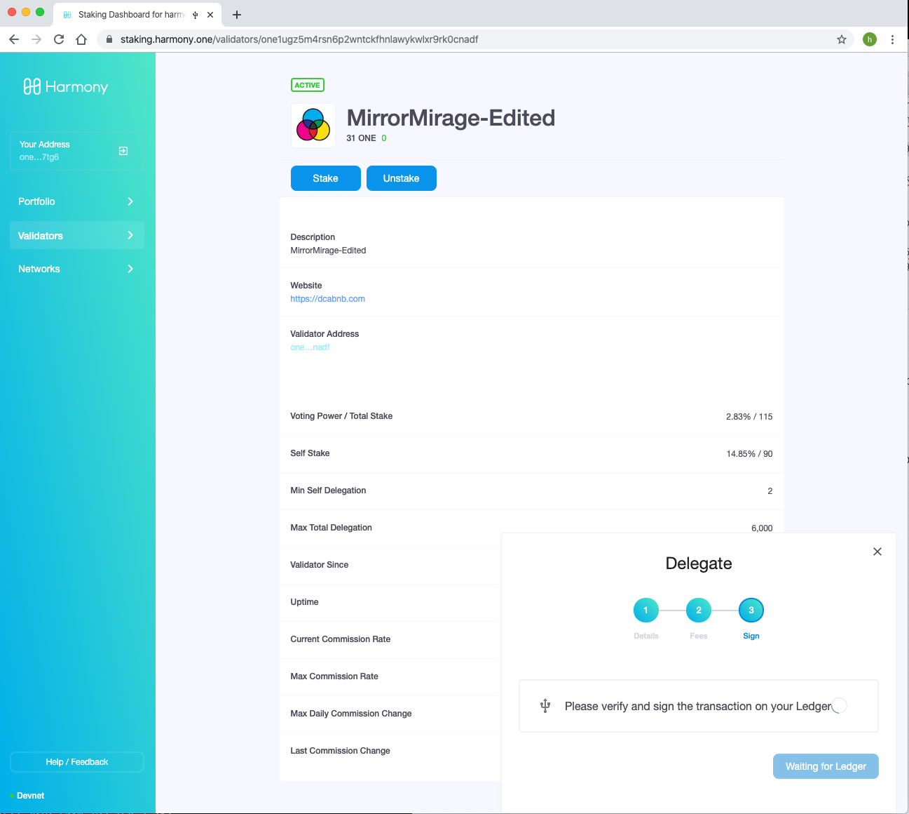

Check your Ledger Nano S. It should display "Delegate Stake" in the LED screen. Click the right button to start signing the transaction:

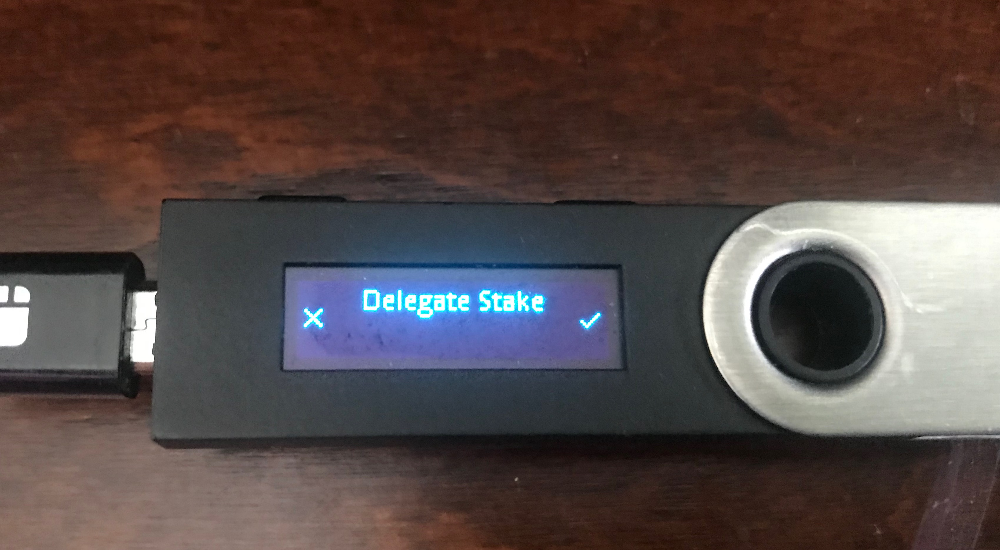

Check the delegator address is correct by pressing left/right buttons. Once confirmed, you can press only the right button to continue: 

Check the delegate transaction amount is correct. Once confirmed, you can press only the right button to continue: 

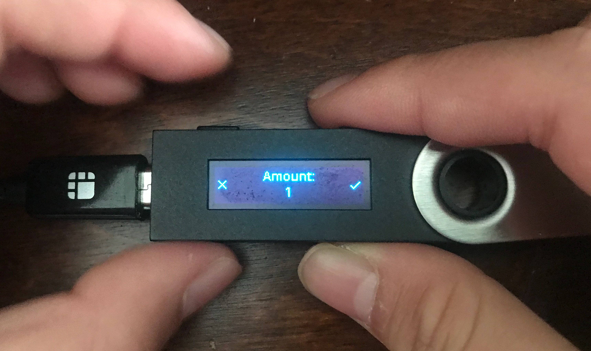

At the last step, you will find the Sign Stake confirmation, press the right button if you want to sign it. Otherwise, you can press the left button to cancel the signing. 

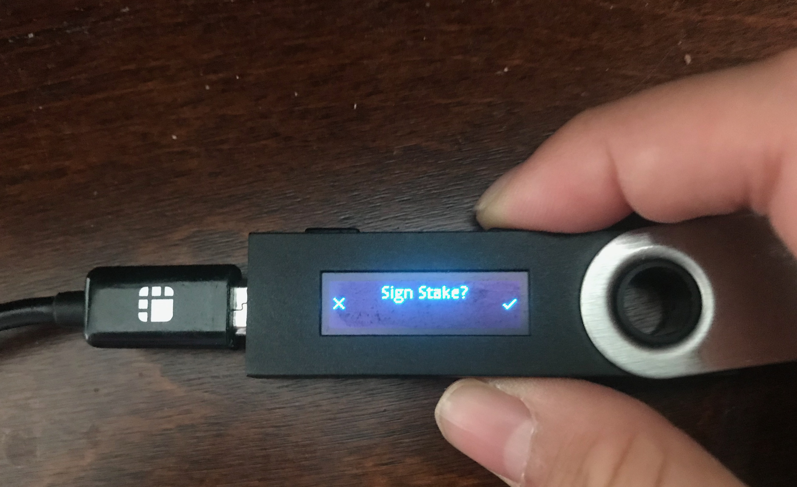

The entire process is shown below:



On the computer, you will find that the transaction is sent and confirming:

After a while, it will change to "Successful delegation!"

