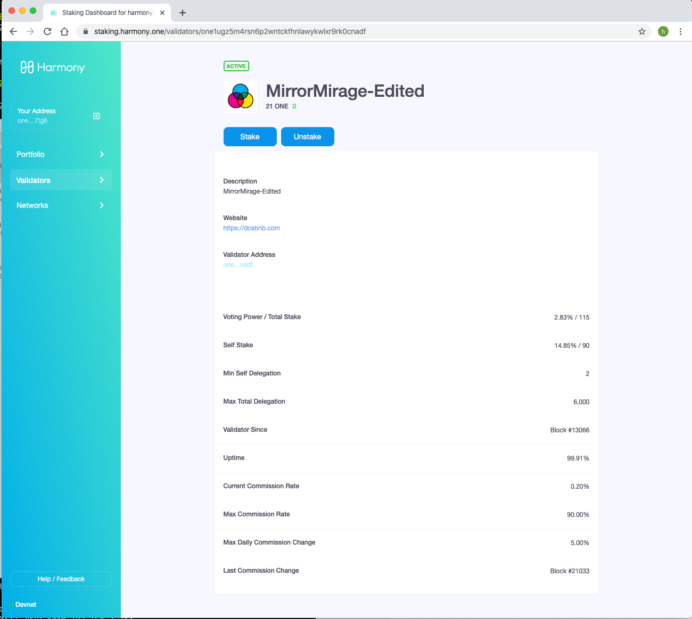
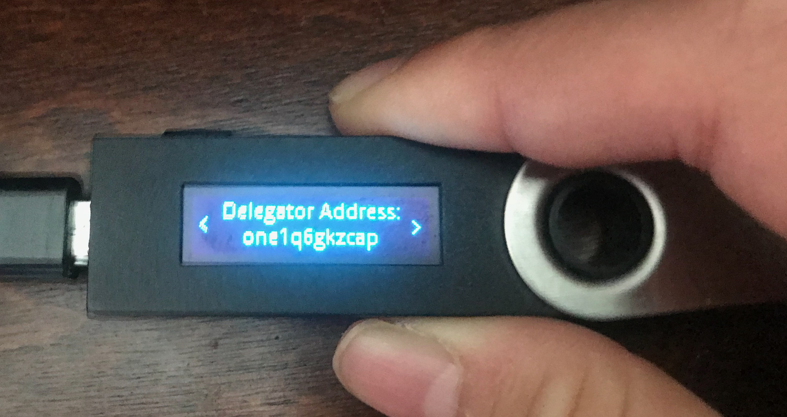
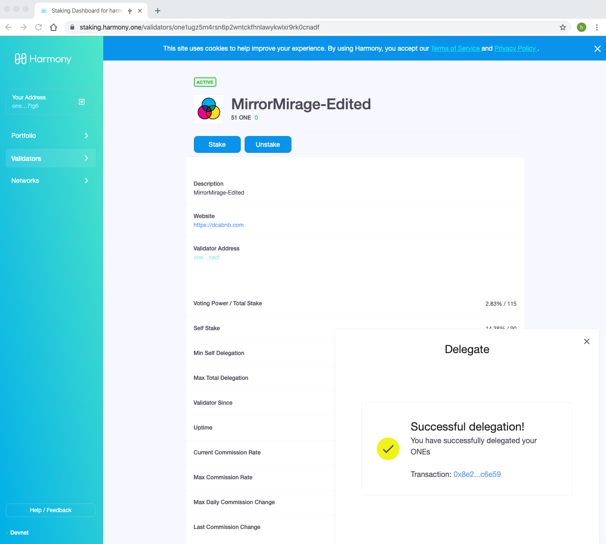

# Sign Staking

Harmony app also supports signing staking transactions. To sign a staking delegation,  click the validators menu on the left side. A list of validators will be displayed as below:  

Click on any validator you want to delegate, it will show as below: 

Click the stake button to start delegation as shown below: 

Input the amount of tokens you want to delegate and keep clicking the next button until it shows "Send". Click the "Send" button and screen will display as below: 

Check your Ledger Nano S. It should display "Delegate Stake" in the LED screen. Click the right button to start signing the transaction:

Check the delegator address is correct by pressing left/right buttons. Once confirmed, you can press only the right button to continue: 

Check the delegate transaction amount is correct. Once confirmed, you can press only the right button to continue: 

At the last step, you will find the Sign Stake confirmation, press the right button if you want to sign it. Otherwise, you can press the left button to cancel the signing. 

The entire process is shown below:



On the computer, you will find that the transaction is sent and confirming:

After a while, it will change to "Successful delegation!"

